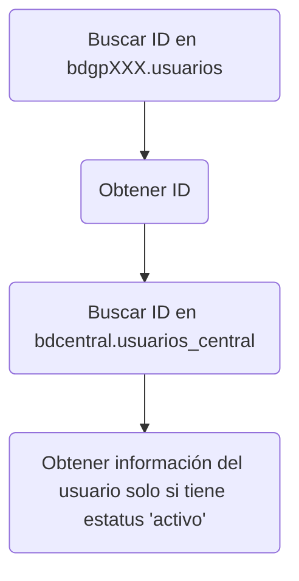
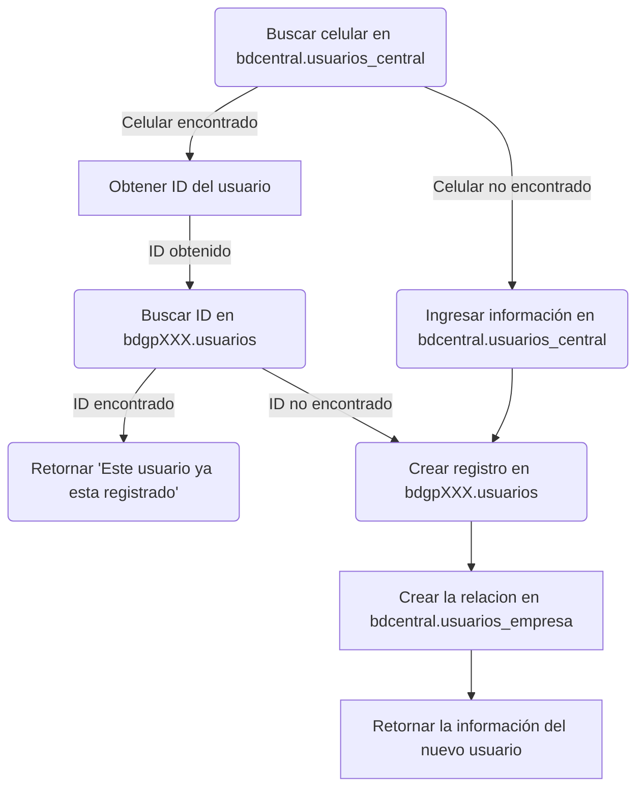

# Prueba técnica - Desarrollo backend con Python usando Flask

**Fecha:** 2024-03-28

**Duración:** Sin límite de tiempo 

**Herramientas/Tecnologías:**

* Flask
* Python

## Descripción

El tarea consiste en desarrollar una API RESTful que permita a los usuarios gestionar la información del cliente. La API debe tener las siguientes funcionalidades:

1. Registro de usuarios nuevos y ya existentes.
2. Edición de usuarios.
3. Listar a todos los usuarios

**SOLO USAR PETICIONES GET Y POST (segun se requiera)**

## Instrucciones para la prueba

- Crear el archivo "Route" dentro de `src/routes` siguiendo la estructura de [/src/routes/CourtRoutes.py](../src/routes/CourtRoutes.py)
- Crear el archivo "Service" dentro de `src/services` siguiendo la estructura de [/src/services/CourtService.py](../src/services/CourtService.py)
- Crear el endpoint en el archivo [src/\_\_init\_\_.py](../src/__init__.py) siguiendo los ejemplos dentro de este mismo archivo

### Proceso para consultar información del usuario

### Proceso para registrar información del usuario

